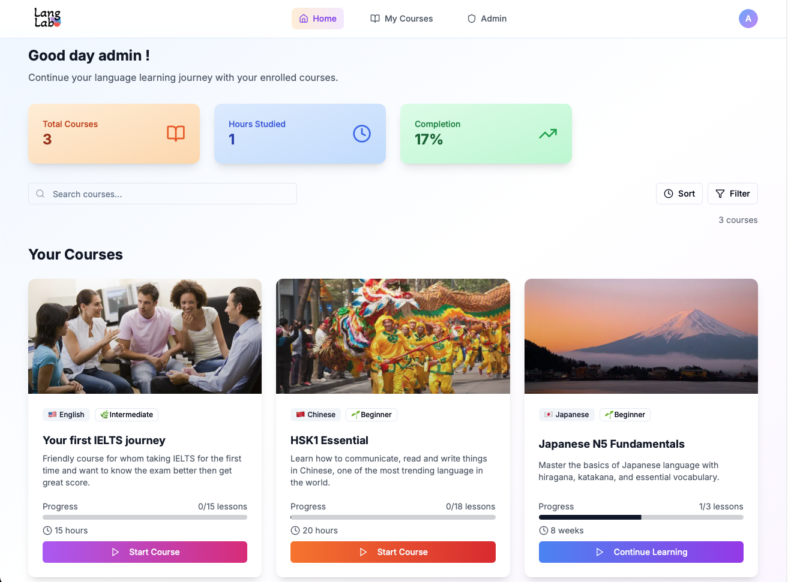

## Piyachetnoy
👋 Hi, I'm Piyachet (Noy), from Thailand <= [Portfolio (click)](https://drive.google.com/file/d/128whd1wi_94tqhOaz-D95KKwBkpjRfoM/view?usp=share_link) 
👀 Interested in software engineering / project management roles 
🌱 My main language is Python, currently trying JavaScript and web development 
🌐 I speak English 🇬🇧, Japanese 🇯🇵, and Thai 🇹🇭 
📫 How to reach me: [My Website](https://piyachetnoy.github.io/piyachet-portfolio/) or [LinkedIn](https://www.linkedin.com/in/piyachet-p2145/) 

## My Projects

### 🚀 Featured Websites

<table>
  <tr>
          <td align="center" width="300">
        <a href="https://dealcat.vercel.app" target="_blank">
          
           
          <b>DealCat</b>
        </a>
         
        2nd market Platform
      </td>
      <td align="center" width="300">
        <a href="https://www.alphamail.ink" target="_blank">
          
           
          <b>AlphaMail</b>
        </a>
         
        AI email assistant
      </td>
      <td align="center" width="300">
        <a href="https://langlab-web.vercel.app/login" target="_blank">
          
           
          <b>LangLab</b>
        </a>
         
        Language learning online course
      </td>
  </tr>
</table>

---
