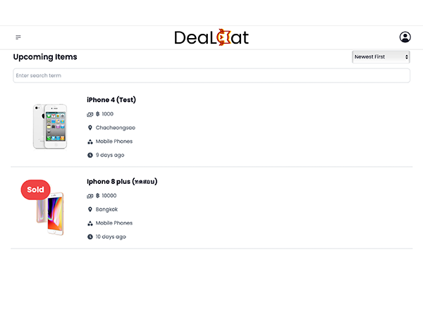
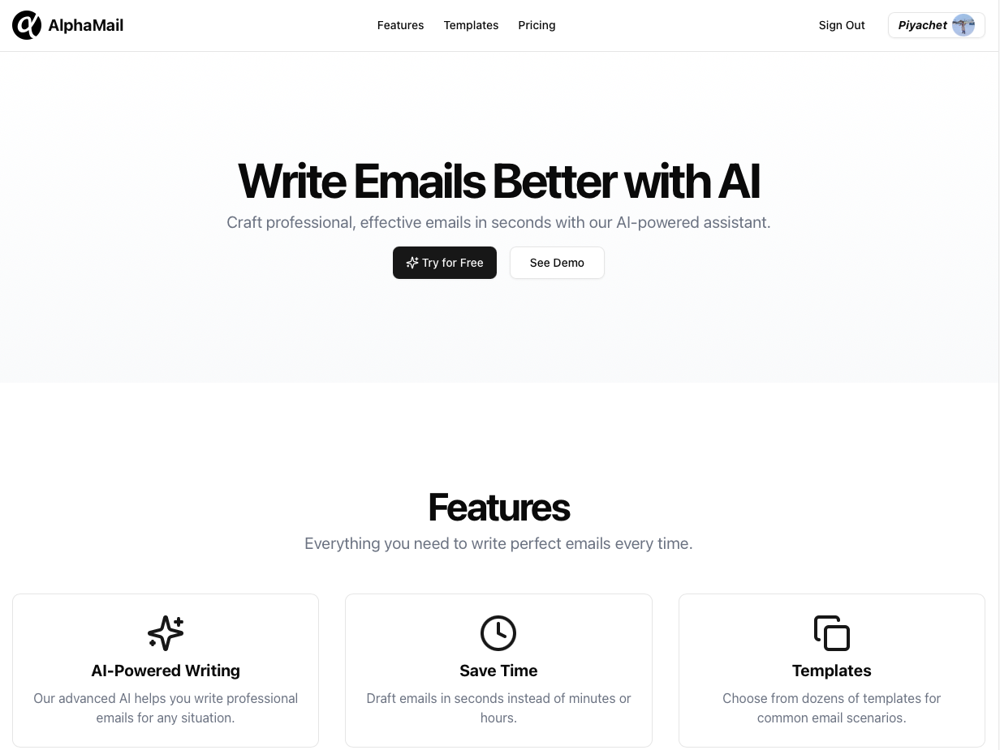
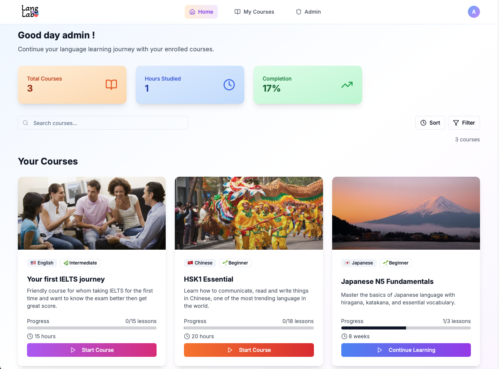

## 🏟️ Piyachetnoy

- 👋 Hi, I'm Piyachet (Noy), from Thailand [@Japan](https://maps.app.goo.gl/BmJ658wHbkWp6T147)
- 👀 Interested in software engineering / project management roles
- 🌱 My main language is Python, and I'm currently trying JavaScript and web development
- 💞️ Looking to collaborate on startup or any fun projects
- 🌐 I speak English 🇬🇧, Japanese 🇯🇵, and Thai 🇹🇭
- 📫 How to reach me: [My Website](https://piyachetnoy.github.io/piyachet-portfolio/) or [LinkedIn](https://www.linkedin.com/in/piyachet-p2145/)

## 🌟 My Projects

### 🚀 Featured Websites

<table>
  <tr>
          <td align="center" width="300">
        <a href="https://dealcat.vercel.app" target="_blank">
          
           
          <b>DealCat</b>
        </a>
         
        2nd market Platform
      </td>
      <td align="center" width="300">
        <a href="https://www.alphamail.ink" target="_blank">
          
           
          <b>AlphaMail</b>
        </a>
         
        AI email assistant
      </td>
      <td align="center" width="300">
        <a href="https://langlab-web.vercel.app/login" target="_blank">
          
           
          <b>LangLab</b>
        </a>
         
        Language learning online course
      </td>
  </tr>
</table>

---
