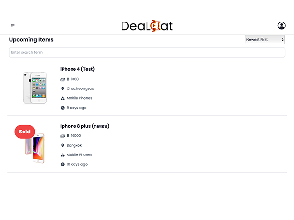
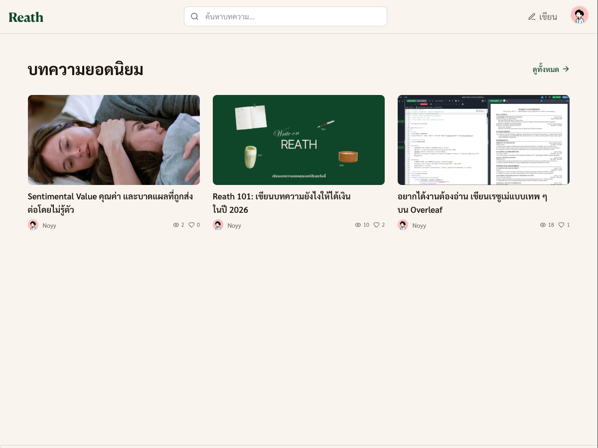
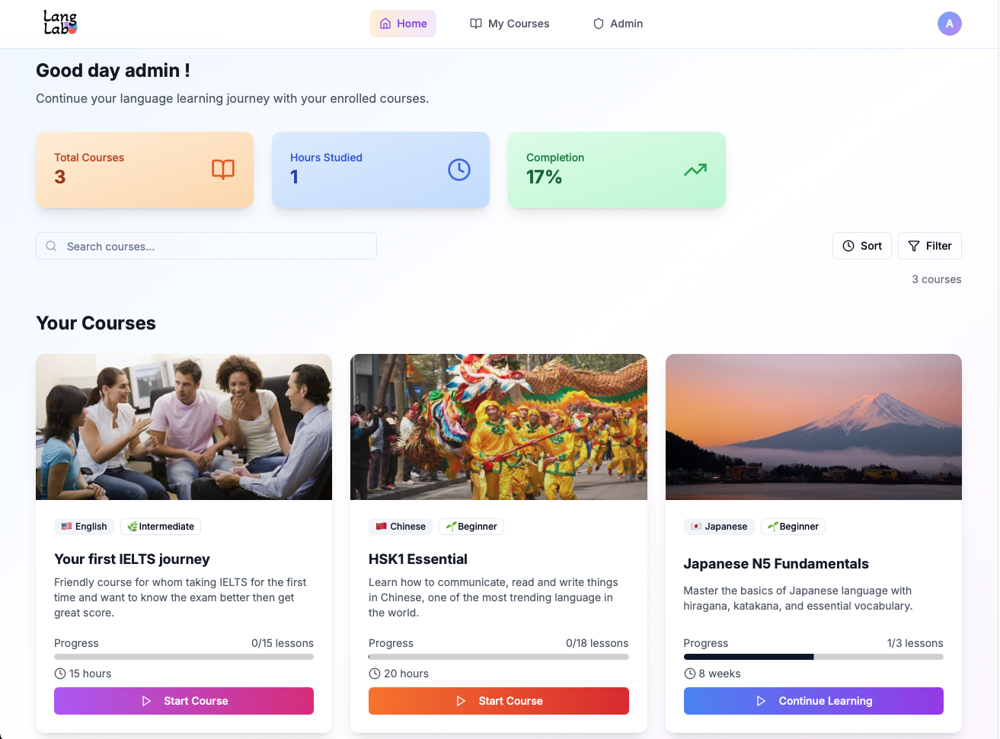

## Piyachetnoy
👋 Hi, I'm Piyachet (Noy), from Thailand 
👀 Interested in software engineering / project management roles 
💞️ Looking to collaborate on startup or any fun project 
🌐 I speak English 🇬🇧, Japanese 🇯🇵, and Thai 🇹🇭 
📫 How to reach me: <a href="https://piyachetnoy.vercel.app" target="_blank" rel="noopener noreferrer">My Professional Website</a> or <a href="https://www.linkedin.com/in/piyachet-p2145/" target="_blank" rel="noopener noreferrer">LinkedIn</a> 

## Tech Stack

  
  
  
  
  
  
  
  
  
  
  
  
  
  

## My Projects

### 🚀 Featured Websites

<table>
  <tr>
          <td align="center" width="300">
        <a href="https://dealcat.vercel.app" target="_blank">
          
           
          <b>DealCat</b>
        </a>
         
        A secondhand marketplace for buying and selling items directly between people.
      </td>
      <td align="center" width="300">
        <a href="https://www.reath.app/" target="_blank">
          
           
          <b>Reath</b>
        </a>
         
        A mass creator economy platform enabling writers to sell articles without gatekeepers.
      </td>
      <td align="center" width="300">
        <a href="https://langlab-web.vercel.app/" target="_blank">
          
           
          <b>LangLab</b>
        </a>
         
        An online language learning platform with structured courses for building fluency.
      </td>
  </tr>
</table>

---
